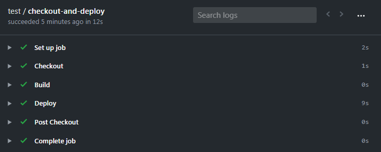

# GitHub Pages deploy

> This deploys a static site on GitHub Pages.



[](https://actions-badge.atrox.dev/Cecilapp/GitHub-Pages-deploy/goto)

## Usage

See [action.yml](action.yml).

```yml
name: GitHub Pages deploy
on:
  push:
    branches:
    - master
jobs:
  checkout-and-deploy:
    runs-on: ubuntu-latest
    steps:
    - name: Checkout
      uses: actions/checkout@v2
    - name: Deploy to GitHub Pages
      uses: Cecilapp/GitHub-Pages-deploy@master
      env:
        GITHUB_TOKEN: ${{ secrets.GITHUB_TOKEN }}
        EMAIL: arnaud@ligny.org
        BUILD_DIR: _site
```

### Configuration

- `EMAIL` (required): A - verified - email
- `BUILD_DIR` (required): Where static/public files are (`_site` by default)
- `CNAME`: The custom domain name (ie: `narno.com`)
- `JEKYLL_SITE`: Set `YES` in case of a [Jekyll](https://jekyllrb.com) site (`NO` by default)

## License

_GitHub Pages deploy_ is a free software distributed under the terms of the MIT license.

© [Arnaud Ligny](https://arnaudligny.fr)
